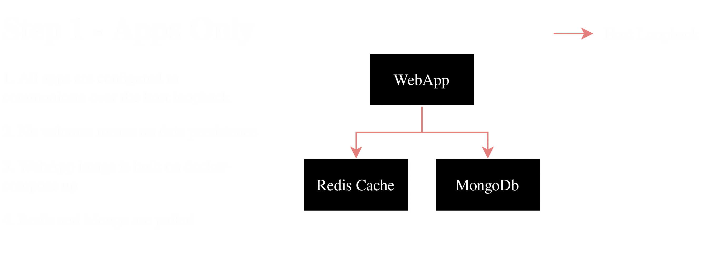

# Step 1

1. Show step 1 design
1. Quickly talk through the WebApp (NotesWebApplicationExtensions.cs)
1. Write docker-compose
1. Demo posting, cache-fetch, cache-miss
1. Demo `netstat -ntlp` and that we're consuming ports on our host
1. Potential for collisions with other apps and/or port exhaustion. Also a pain to scale as each replica needs its own config. 

```docker-compose
version: "3.8"
services:
  webapp:
    build:
      context: webapp/DemoWebApp
      dockerfile: Dockerfile
    ports: ["5000:5000"]
  mongo: 
    image: mongo:latest
    ports: ["27017:27017"]
  redis:
    image: redis:latest
    ports: ["6379:6379"]
```



