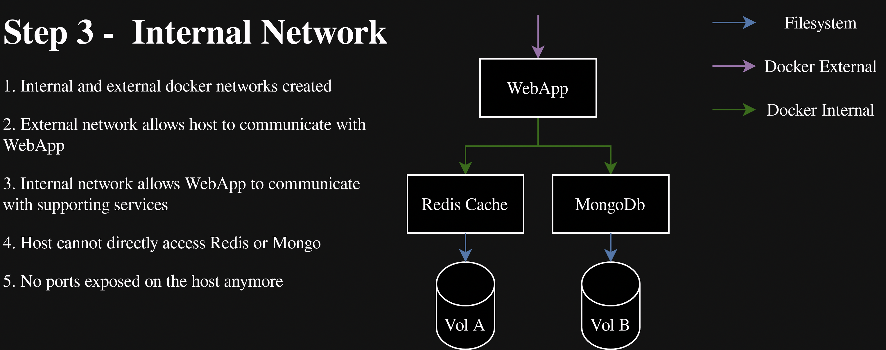

# Step 1

1. Show step 1 design
1. Quickly talk through the WebApp (NotesWebApplicationExtensions.cs)
1. Write docker-compose
1. Acknowledge using rider for docker-compose for ease. `docker-compose up/down`
1. Demo posting, cache-fetch, cache-miss
1. Demo `netstat -ntlp` and that we're consuming ports on our host
1. Potential for collisions with other apps and/or port exhaustion. Also a pain to scale as each replica needs its own config.
1. Demo lack of persistence

```docker-compose
version: "3.8"
services:
  webapp:
    build:
      context: webapp/DemoWebApp
      dockerfile: Dockerfile
    ports: ["5000:5000"]
    depends_on:
      - mongo
      - redis
  mongo: 
    image: mongo:latest
    ports: ["27017:27017"]
  redis:
    image: redis:latest
    ports: ["6379:6379"]
```


# Step 2

1. Show step 2 design
1. Quickly rehash what volumes are
1. Mention the persistence mountpoints for redis and mongo (`/data` by coincidence)
1. Modify docker-compose
1. Demo that data now survives a restart

```
version: "3.8"
services:
  webapp:
    build:
      context: webapp/DemoWebApp
      dockerfile: Dockerfile
    ports: ["8080:8080"]
    depends_on:
      - mongo
      - redis
  mongo: 
    image: mongo:latest
    ports: ["27017:27017"]
    volumes: 
      - mongodata:/data/db
  redis:
    image: redis:latest
    ports: ["6379:6379"]
    volumes: 
      - redisdata:/data
    
volumes:
    mongodata:
    redisdata:
```docker-compose

```


# Step 3

1. Show step 3 design
1. Discuss how docker manages its own virtual networks
1. Internal networks are only accessible by containers in a specific compose stack
1. External networks are accessible by anything in the docker daemon or on the host
1. Have to manually create external network `docker network create host-network`
1. Internal networks created on `docker-compose up`
1. Modify docker-compose
1. Get IP of webapp using `docker inspect <id> | jq '.[0].NetworkSettings.Networks."host-network".IPAddress'`
1. Demonstrate app doesn't work (ask why, no more ports on host)
1. Modify settings so apps can resolve eachother
1. Demonstrate app now works
1. Demonstrate no host ports used with `netstat -ntlp`

```docker-compose
version: "3.8"
services:
  
  webapp:
    build:
      context: ./webapp/DemoWebApp
      dockerfile: Dockerfile
    networks:
      - host-network
      - internal-network
    depends_on:
      - mongo
      - redis
      
  mongo:
    container_name: mongo
    image: mongo:latest
    volumes: 
      - mongodata:/data/db
    networks:
      - internal-network
        
  redis:
    container_name: redis
    image: redis:latest
    volumes: 
      - redisdata:/data
    networks:
      - internal-network
    
volumes:
    mongodata:
    redisdata:

networks:
  host-network:
    external: true
  internal-network:
    external: false
```



# Step 4

1. Show step 4 design
1. Discuss why we'd use a reverse proxy (single ingress point, single host port, upgrading https, enforcing policies etc.)
1. Modify docker-compose to add nginx bound to host port 443
1. Use dockerfile to generate cert rather than nginx:latest
1. Add config file and mount volume
1. Mention certbot for generating SSL certificates
1. Access app through `localhost/swagger`
1. Note http->https upgrade

```docker-compose
version: "3.8"
services:
  
  reverse-proxy:
    build: 
      context: ./nginx
      dockerfile: Dockerfile
    ports:
      - "80:80"
      - "443:443"
    networks:
      - host-network
      - internal-network
    depends_on:
      - webapp
  
  webapp:
    container_name: webapp
    build:
      context: ./webapp/DemoWebApp
      dockerfile: Dockerfile
    networks:
      - internal-network
    depends_on:
      - mongo
      - redis
      
  mongo:
    container_name: mongo
    image: mongo:latest
    volumes: 
      - mongodata:/data/db
    networks:
      - internal-network
        
  redis:
    container_name: redis
    image: redis:latest
    volumes: 
      - redisdata:/data
    networks:
      - internal-network
    
volumes:
    mongodata:
    redisdata:

networks:
  host-network:
    external: true
  internal-network:
    external: false
```


# Step 5

1. Show the design for step 5
1. Discuss the need for load balancing
1. Acknowledge that we're only scaling the webapp here and that you might want to scale dbs too
1. Modify docker-compose
1. Modify nginx.conf
1. Show multiple replicas created
1. Show in webapp logs that repeate create requests are being round-robinned

```docker-compose
version: "3.8"
services:
  
  reverse-proxy:
    build: 
      context: ./nginx
      dockerfile: Dockerfile
    ports:
      - "80:80"
      - "443:443"
    networks:
      - host-network
      - load-balancer-network
    depends_on:
      - webapp
  
  webapp:
    build:
      context: ./webapp/DemoWebApp
      dockerfile: Dockerfile
    deploy:
      replicas: 4
    networks:
      - internal-network
      - load-balancer-network    
    depends_on:
      - mongo
      - redis

  mongo:
    container_name: mongo
    image: mongo:latest
    volumes: 
      - mongodata:/data/db
    networks:
      - internal-network
        
  redis:
    container_name: redis
    image: redis:latest
    volumes: 
      - redisdata:/data
    networks:
      - internal-network
    
volumes:
    mongodata:
    redisdata:

networks:
  host-network:
    external: true
  internal-network:
    external: false
  load-balancer-network:
    external: false
```


